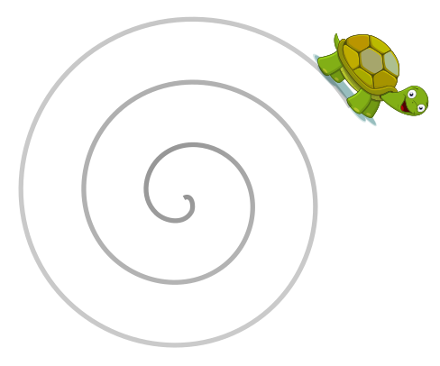
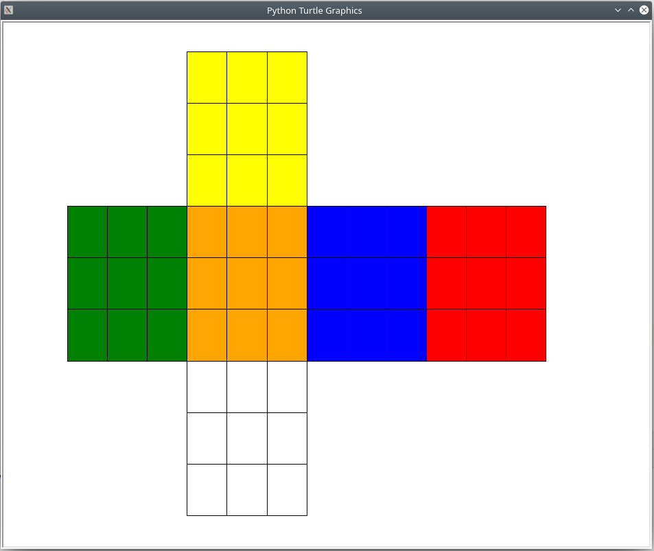

[Back to Index](README.md)

# Rubik Cube Solver with python's 🐢`turtle` module

For this tutorial we will use the python module `rubik-solver` 
for solving a rubiks cube and 
[`turtle`](https://docs.python.org/3/library/turtle.html) 
for allowing entering in the current cube's state.
First, we need to install prerequisites using the command:

    pip install rubik_solver --user

See also https://github.com/Wiston999/python-rubik for more information
on the notation used by this module, and for information about the
algorithms it uses.

The `turtle` module is similar to
the classic Logo turtle. It allows drawing points, lines and shapes using a pen
relative to the current position and rotation. Initially the turtle is
pointing to the east in the center of the canvas.


Image from https://commons.wikimedia.org/wiki/File:Turtle_clip_art.svg
under a creative commons license

Although they may use x/y coordinates relative to the top left of the screen by
default and don't keep track of current heading rotation except in some 
cases, many of the concepts with drawing are essentially the same as those 
seen in Scalable Vector Graphics (SVG) and the html5 `<canvas>` element.

If you would like to see more examples of `turtle` module in use, 
check out https://github.com/topics/python-turtle.

## 1. Drawing the Cube Sides

Up first is a number of imports and constants we'll use:

```python
import time                     # For the `sleep` method, delaying without wasting CPU
import turtle                   # For the canvas UI display
from rubik_solver import utils  # For solving the problem

# Define the size of each square in pixels
CUBE_SIZE = 50
# Register the size of each side in pixels
SIDE_SIZE = CUBE_SIZE * 3
# Define all possible colors to allow cycling/figuring out which color comes next
ALL_COLORS = ['yellow', 'green', 'orange', 'blue', 'red', 'white']
```

We'll use a python class to group together common information about
the current state of each of the 9 squares for each side.

```python
class CubeSide:
    """
    The cube side datatype, storing what color each row/col currently is
    and where the side is relative to the top-left corner

    :offset_x:
    :offset_y:
    :initial_color:
    """
    def __init__(self,
                 offset_x: int,
                 offset_y: int,
                 initial_color: str):

        # Set these so we can know where to draw the side relative
        # to the top-left corner of the canvas in pixels
        self.offset_x = offset_x
        self.offset_y = offset_y

        # Generate a 3x3 matrix with the colors stored
        self.rows = []
        for x in range(3):
            col = []
            for y in range(3):
                col.append(initial_color)
            self.rows.append(col)

# Define the cube sides and where to place them
#         [Side 1]
# [Side 2][Side 3][Side 4][Side 5]
#         [Side 6]
CUBE_SIDES = [CubeSide(SIDE_SIZE, 0, 'yellow'),
              CubeSide(0, SIDE_SIZE, 'green'),
              CubeSide(SIDE_SIZE, SIDE_SIZE, 'orange'),
              CubeSide(SIDE_SIZE * 2, SIDE_SIZE, 'blue'),
              CubeSide(SIDE_SIZE * 3, SIDE_SIZE, 'red'),
              CubeSide(SIDE_SIZE, SIDE_SIZE * 2, 'white')]
```

Now that we've defined the sides, we need to draw the cube, iterating 
through each row and column of each cube side.

```python
def draw(cube_side):
    """
    Draw all rows and columns
    """
    pen.showturtle()
    for row in range(3):
        for col in range(3):
            draw_row_col(cube_side, row, col)
    pen.hideturtle()


def draw_row_col(cube_side, row, col):
    """
    Draw a single square of a row/column
    """

    # Go to the top left position of the square to be drawn
    pen.penup()
    pen.goto(cube_side.offset_x + row * CUBE_SIZE,
             cube_side.offset_y + col * CUBE_SIZE)
    pen.pendown()

    # Turn off low-level animation to increase performance
    screen.tracer(False)
    # Set the line and background color
    pen.color('black')
    pen.fillcolor(cube_side.rows[row][col])
    pen.begin_fill()

    # Using setheading() in degrees 0-360 here
    # because of rounding errors with right()
    heading = 0
    for side in range(4):
        pen.setheading(heading)
        pen.forward(CUBE_SIZE)
        heading += 90

    pen.end_fill()
    pen.penup()
    screen.tracer(True)
    time.sleep(0.01)


# Create turtle screen and pen
screen = turtle.Screen()
screen.setworldcoordinates(0, (SIDE_SIZE*3)+7,
                           (SIDE_SIZE*4)+7, 0)

pen = turtle.Turtle(shape="turtle")
pen.speed('fast')

for cube_side in CUBE_SIDES:
    draw(cube_side)

# Keep running forever
# **Note any code needs to be inserted before this line, or else
# it will never be executed.**
screen.mainloop()
```



## 2. Responding to Mouse Events on Side Squares

In order to enter in the current state of the cube, we need to ask for
input from the user in some way. In this case we'll opt for cycling 
through colors when the user clicks within one of the boxes, binding
mouse click events so we can add interactivity with `screen.onclick`.

```python
def xy_coords_to_row_col(cube_side, x, y):
    """
    Convert x/y coordinates in pixels to the row/column
    of an individual square in a cube side.
    """

    def point_in_rectangle(bottom_left, top_right, point):
        return (bottom_left[0] < point[0] < top_right[0]) and \
               (bottom_left[1] < point[1] < top_right[1])

    for row in range(3):
        for col in range(3):
            if point_in_rectangle(
                [cube_side.offset_x + CUBE_SIZE*row,
                 cube_side.offset_y + CUBE_SIZE*col],
                [cube_side.offset_x + CUBE_SIZE + CUBE_SIZE*row,
                 cube_side.offset_y + CUBE_SIZE + CUBE_SIZE*col],
                [x, y]
            ):
                return [row, col]
    return None


def cycle_cube_color(cube_side, row, col):
    """
    Make a cube the next color of 6 available colors and refresh
    """

    # Figure out where relative to the start of the list the current color is
    current_color_index = ALL_COLORS.index(cube_side.rows[row][col])

    # Get the next color, starting at the start color again if we run out
    try:
        next_color = ALL_COLORS[current_color_index + 1]
    except IndexError:
        next_color = ALL_COLORS[0]

    # Remember the color+draw
    cube_side.rows[row][col] = next_color
    draw_row_col(cube_side, row, col)

    
def onclick(x, y):
    for cube_side in CUBE_SIDES:
        row_col = xy_coords_to_row_col(cube_side, x, y)
        if row_col:
            row, col = row_col
            cycle_cube_color(cube_side, row, col)


# Bind/listen for the click event, which passes the x and y 
# coordinates as 2 parameters to the onclick function
screen.onclick(onclick)
```

## 3. Solving

Next, we need to do the actual solving code. Check out 
https://github.com/Wiston999/python-rubik/tree/master/rubik_solver/Solver
for information about the algorithms used.

```python
def solve_and_exit():
    colors = ''
    for cube_side in CUBE_SIDES:
        for row in cube_side.rows:
            for color in row:
                # Get the first letter of each color to convert to a
                # format rubik_solver understands
                colors += color[0].lower()

    # Output the rubik_solver solutions to the console
    # It would be possible to show this using `turtle` too
    print(utils.solve(colors, 'Beginner'))
    print(utils.solve(colors, 'CFOP'))
    print(utils.solve(colors, 'Kociemba'))

    # Exit the program
    raise SystemExit()


# Show a "solve and exit" label which functions as a button
# in the top-right corner of the screen
pen.showturtle()
pen.penup()
pen.goto(SIDE_SIZE * 3.3, 20)
pen.write("solve and exit >", font=("Arial", 16, "normal"))
pen.hideturtle()
```

We'll need to update our `onclick` function here so that the above function
is executed when the "solve and exit" button is clicked.

```python
def onclick(x, y):
    if y < 50 and x > SIDE_SIZE * 3.3:
        # "solve and exit" clicked!
        solve_and_exit()
    
    for cube_side in CUBE_SIDES:
        row_col = xy_coords_to_row_col(cube_side, x, y)
        if row_col:
            row, col = row_col
            cycle_cube_color(cube_side, row, col)
```

See [turtle_rubik_solver.py](turtle_rubik_solver.py) 
for the completed file.
